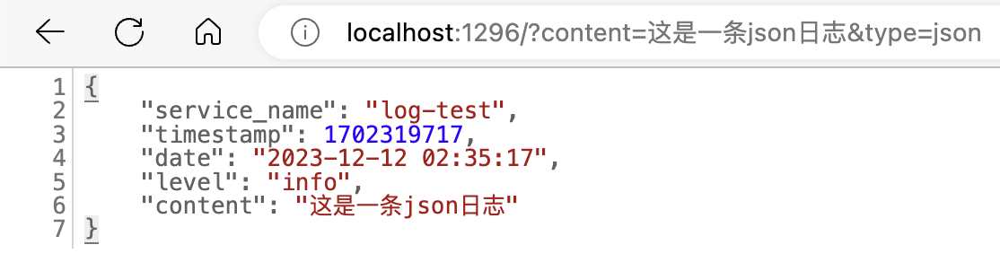
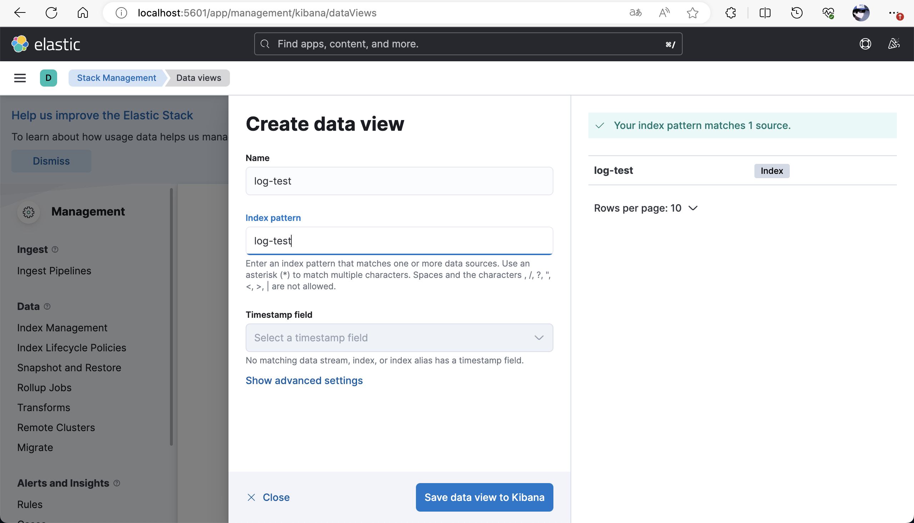
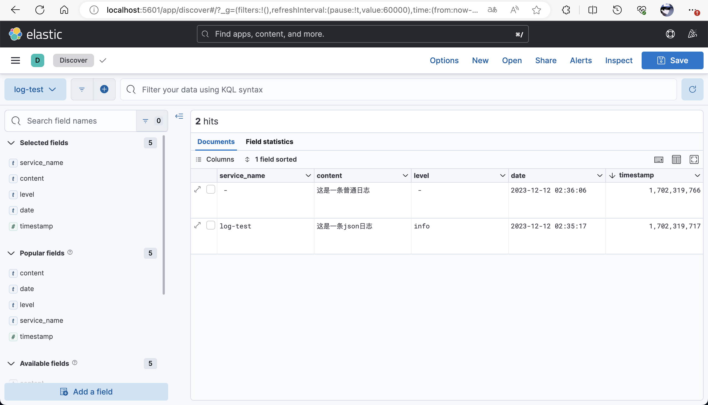
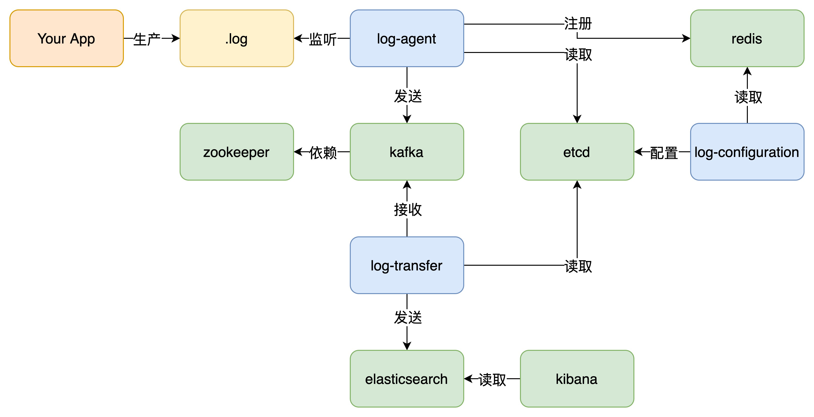

# log-collection

log-collection是一个日志收集工具，其基于业界常用的ELK解决方案。

## 快速开始

1. 使用Docker Compose file启动容器

```yml
version: "3.8"

services:
  zookeeper:
    image: docker.io/bitnami/zookeeper:3.8.1
    container_name: zookeeper
    restart: always
    ports:
      - "2181:2181"
    volumes:
      - "zookeeper_data:/bitnami"
    networks:
      - log-collection
    environment:
      - ALLOW_ANONYMOUS_LOGIN=yes
  kafka:
    image: docker.io/bitnami/kafka:3.4
    container_name: kafka
    restart: always
    ports:
      - "9092:9092"
    volumes:
      - "kafka_data:/bitnami"
    networks:
      - log-collection
    environment:
      - ALLOW_PLAINTEXT_LISTENER=yes
      - KAFKA_ENABLE_KRAFT=no
      - KAFKA_CFG_ZOOKEEPER_CONNECT=zookeeper:2181
      - KAFKA_CFG_LISTENERS=PLAINTEXT://:9092
    depends_on:
      - zookeeper
  etcd:
    image: bitnami/etcd:latest
    container_name: etcd
    restart: always
    ports:
      - "2379:2379"
      - "2380:2380"
    networks:
      - log-collection
    environment:
      - ALLOW_NONE_AUTHENTICATION=yes
      - ETCD_ADVERTISE_CLIENT_URLS=http://etcd:2379
  redis:
    image: bitnami/redis:latest
    container_name: redis
    restart: always
    ports:
      - "6379:6379"
    volumes:
      - redis_data:/bitnami/redis/data
    networks:
      - log-collection
    environment:
      - ALLOW_EMPTY_PASSWORD=yes
  elasticsearch:
    image: bitnami/elasticsearch:8.7.1
    container_name: elasticsearch
    restart: always
    ports:
      - "9200:9200"
    volumes:
      - elasticsearch_data:/bitnami/elasticsearch/data
    networks:
      - log-collection
  kibana:
    image: bitnami/kibana:8.7.1
    container_name: kibana
    restart: always
    ports:
      - "5601:5601"
    volumes:
      - kibana_data:/bitnami/kibana
    networks:
      - log-collection
    depends_on:
      - elasticsearch
  log-agent:
    image: lyljd/log-agent:1.0-arm8
    container_name: log-agent
    restart: always
    volumes:
      - log-agent_data:/app/log
      - ./log-test_log:/app/log-test_log
    networks:
      - log-collection
    environment:
      KAFKA_ADDR: kafka:9092
      ETCD_ADDR: host.docker.internal:2379
      ETCD_LOG_CONFIGURATION_KEY: log-configuration
      REDIS_ADDR: host.docker.internal:6379
      REDIS_REGISTER_KEY: log-configuration
    depends_on:
      - kafka
  log-configuration:
    image: lyljd/log-configuration:1.0-arm8
    container_name: log-configuration
    restart: always
    ports:
      - "1295:1295"
    volumes:
      - log-configuration_data:/app/log
    networks:
      - log-collection
    environment:
      ETCD_ADDR: host.docker.internal:2379
      ETCD_LOG_CONFIGURATION_KEY: log-configuration
      REDIS_ADDR: host.docker.internal:6379
      REDIS_REGISTER_KEY: log-configuration
  log-transfer:
    image: lyljd/log-transfer:1.0-arm8-upgrade
    container_name: log-transfer
    restart: always
    volumes:
      - log-transfer_data:/app/log
      - /etc/localtime:/etc/localtime:ro
    networks:
      - log-collection
    environment:
      KAFKA_ADDR: kafka:9092
      KAFKA_CONSUMER_GROUP: log-transfer
      ETCD_ADDR: host.docker.internal:2379
      ETCD_LOG_CONFIGURATION_KEY: log-configuration
      ELASTICSEARCH_ADDR: http://host.docker.internal:9200
      ELASTICSEARCH_ANALYZER: standard
    depends_on:
      - kafka
  log-test:
    image: lyljd/log-test:1.0-arm8-upgrade
    container_name: log-test
    restart: always
    ports:
      - "1296:1296"
    volumes:
      - ./log-test_log:/app/log
      - /etc/localtime:/etc/localtime:ro
    networks:
      - log-collection

volumes:
  zookeeper_data:
    name: zookeeper_data
  kafka_data:
    name: kafka_data
  redis_data:
    name: redis_data
  elasticsearch_data:
    name: elasticsearch_data
  kibana_data:
    name: kibana_data
  log-agent_data:
    name: log-agent_data
  log-configuration_data:
    name: log-configuration_data
  log-transfer_data:
    name: log-transfer_data

networks:
  log-collection:
    name: log-collection
```

2. 访问`http://localhost:1295` 配置log-agent欲监测的日志文件


3. 访问`http://localhost:1296/?content=&type=` 模拟生产一条日志到.log文件中




4. 访问`http://localhost:5601/app/management/kibana/dataViews` 创建数据视图



5. 访问`http://localhost:5601/app/discover` 即可看到刚才生产的日志



## 架构



## 优势

- 使用etcd实现配置热更新
- 使用redis集中管理配置，并提供可视化界面
- 使用kafka作缓冲使其可处理更大量的日志
- 开箱即用，一键启动
