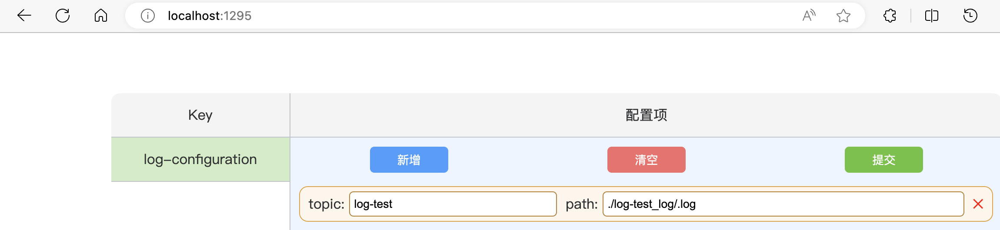

# log-collection

log-collection是一个日志收集工具，其基于业界常用的ELK解决方案。

## 快速开始

1. 使用Docker Compose file启动容器

    intel/amd cpu: `docker-compose -f docker-compose.intel-amd.yml up -d`

    apple cpu: `docker-compose -f docker-compose.apple.yml up -d`

2. 访问`http://localhost:1295` 配置log-agent欲监测的日志文件

3. 访问`http://localhost:1296/?content=&type=` 模拟生产一条日志到.log文件中

4. 访问`http://localhost:5601/app/management/kibana/dataViews` 创建数据视图

5. 访问`http://localhost:5601/app/discover` 即可看到刚才生产的日志

## 架构

## 优势

- 使用etcd实现配置热更新
- 使用redis集中管理配置，并提供可视化界面
- 使用kafka作缓冲使其可处理更大量的日志
- 开箱即用，一键启动
